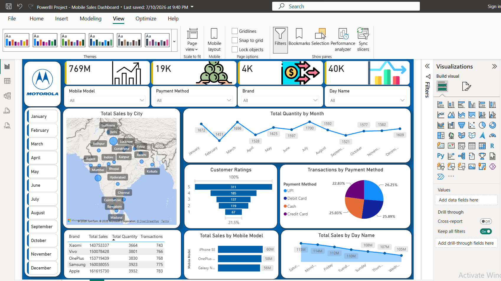
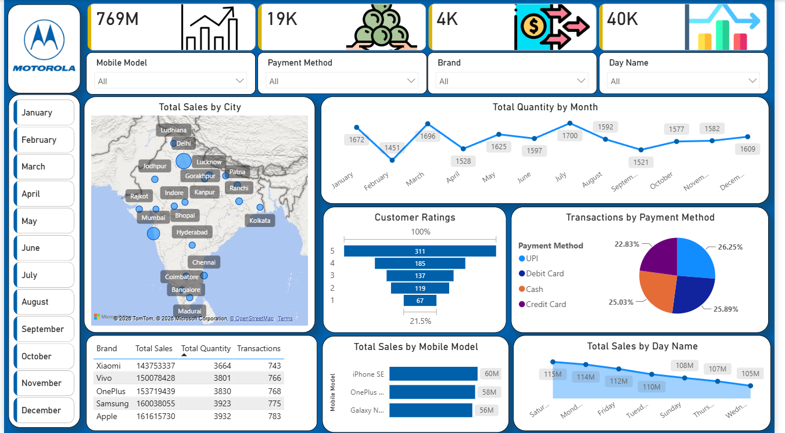

# 📱 Mobile Sales Dashboard — Power BI Project

An interactive Power BI dashboard analyzing mobile phone sales data across cities, brands, and payment methods — built to track sales performance, customer behavior, and trends over time.

## 📊 Overview

This dashboard provides a single-page, interactive view of mobile sales performance with real-time filtering by month, brand, mobile model, payment method, and day of week.

## 🔑 Key Metrics (KPI Cards)
- **Total Sales**
- **Total Quantity** sold
- **Total Transactions**
- **Average** sale value

## 📈 Visuals Included
| Visual | Insight |
|---|---|
| Map | Sales distribution across cities |
| Line Chart | Sales/quantity trend by month & day |
| Clustered Bar Chart | Total sales by mobile model |
| Pie Chart | Transaction split by payment method |
| Funnel Chart | Customer ratings distribution |
| Area Chart | Total sales by day of the week |
| Table | Sales, quantity & transactions by brand |
| Slicers | Filter by Mobile Model, Brand, Payment Method, Day Name, Month |

## 🗂️ Dataset Fields
`Date`, `City`, `Brand`, `Mobile Model`, `Payment Method`, `Customer Ratings`, `Day Name`

## 🛠️ Tools Used
- Power BI Desktop
- Power Query (data cleaning/transformation)
- DAX (KPI measures)
- Data Visualization & Interactive Filtering

## 🎯 Key Skills Demonstrated
- Building KPI-driven dashboards
- Geo-spatial visualization (map)
- Time-series trend analysis
- DAX measure creation
- Data storytelling for business decisions

## 📁 Files
- `PowerBI_Project_-_Mobile_Sales_Dashboard.pbix` — full Power BI project file

## 📷 Preview

## 👤 Author
**Vishal Gadekar**
- GitHub: [gadekarvishal08](https://github.com/gadekarvishal08)
- LinkedIn: [vishal-gadekar483](https://www.linkedin.com/in/vishal-gadekar483)
